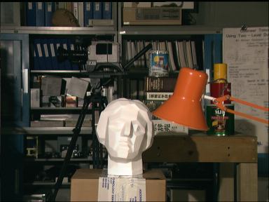
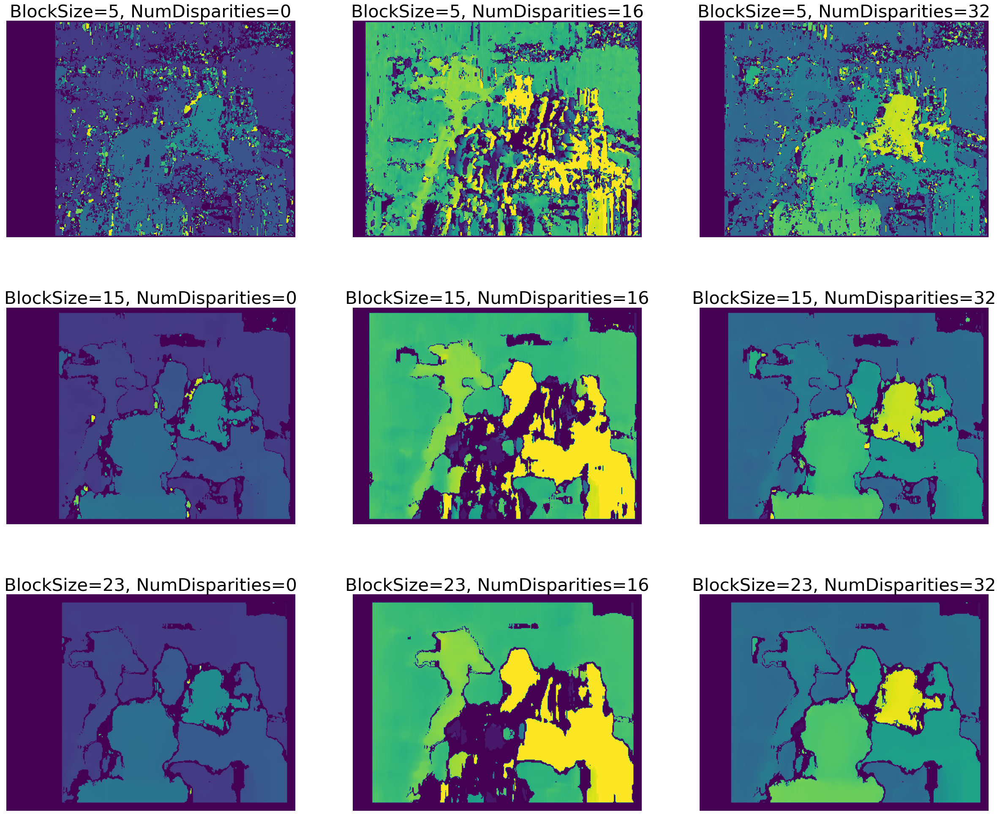
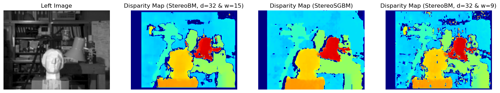

# 🎯 Stereo Depth Estimation — Disparity Map Generation

<div align="center">



</div>

Implementing and comparing **three stereo matching algorithms** for dense disparity map estimation from rectified stereo image pairs — evaluating how block size, disparity range, and matching strategy affect depth reconstruction quality.

---

## 🎯 What This Project Does

> *"How does algorithm choice and parameter tuning affect the quality of depth estimation from stereo cameras?"*

Systematically benchmarks three OpenCV stereo matching algorithms across multiple parameter configurations on standard stereo datasets, visualizing the trade-offs between accuracy and smoothness.

---

## 🔬 Approach

**1. Preprocessing**
- Gaussian blur smoothing on both left/right images to reduce noise before matching

**2. Algorithms Compared**

| Algorithm | Key Strength |
|---|---|
| **StereoBM** | Fast, real-time capable, good for textured regions |
| **StereoSGBM** | Semi-global optimization, smoother disparity maps |
| **StereoSGBM (HH mode)** | Full 8-direction scan — highest quality, slower |

**3. Parameter Sweep**
- Block sizes tested: `5`, `15`, `23`
- numDisparities tested: `0`, `16`, `32`
- Grid of 9 disparity maps generated to visualize sensitivity to parameter choices

<div align="center">



</div>

**4. StereoSGBM Configuration**
```
minDisparity=0, numDisparities=32, blockSize=5
P1=8×1×5², P2=16×1×5²
disp12MaxDiff=1, uniquenessRatio=16
speckleWindowSize=100, speckleRange=2
```

<div align="center">



</div>

**5. Multi-Dataset Testing**
- Tested on multiple stereo pairs: `tsukuba`, `im0`, `im1`, `im2`
- Allows cross-dataset generalization analysis

---

## 💡 Key Finding

> StereoSGBM in HH mode produces significantly smoother disparity maps than StereoBM — especially in low-texture regions like walls and floors. However, StereoBM remains ~5× faster, making it preferable for real-time applications. Larger block sizes reduce noise but lose fine depth boundaries.

---

## 🛠️ Tech Stack

`Python` · `OpenCV` · `NumPy` · `Matplotlib`

---

## 📁 Key Files

| File | Description |
|---|---|
| `Disparity_map.ipynb` | Full implementation — all 3 algorithms, parameter sweep, visualization |
| `tsukuba_l.png` / `tsukuba_r.png` | Classic stereo benchmark pair |
| `im0–im2 left/right` | Additional stereo test pairs |

> Reference dataset: [Middlebury Stereo Datasets](https://vision.middlebury.edu/stereo/)

---

## 📊 Experiments

| Config | Block Size | numDisparities | Algorithm |
|---|---|---|---|
| Baseline | 9 | 32 | StereoBM |
| Parameter sweep | 5, 15, 23 | 0, 16, 32 | StereoBM |
| Quality comparison | 5 | 32 | StereoBM vs SGBM vs SGBM-HH |
